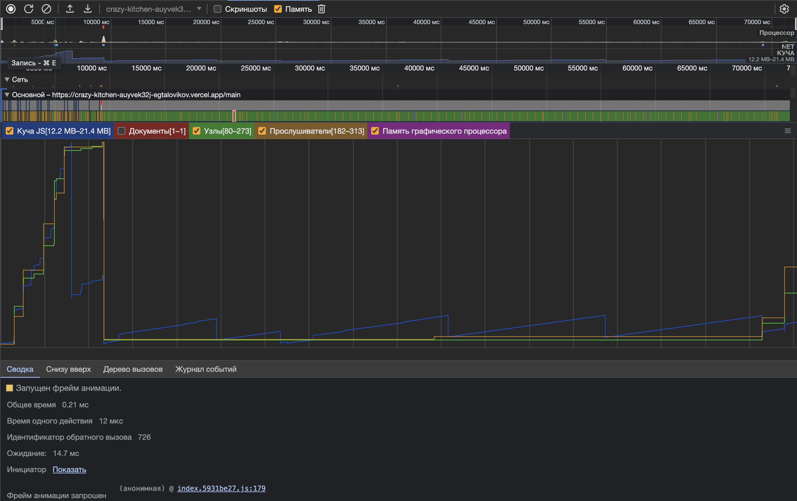

# Отчет о Тестировании на Утечки Памяти в Приложении CRAZY KITCHEN

## Методика

Для тестирования на утечки памяти мы использовали следующую методику:

1. **Запуск приложения:** Запуск приложения в режиме разработки.

2. **Навигация по приложению:** После запуска приложения мы активно взаимодействовали с ним, выполняя различные действия, такие как переход между страницами, выполнение операций и т. д.

3. **Мониторинг утечек:** Мы использовали DevTools для мониторинга утечек памяти в режиме реального времени. Мы фиксировали изменения в использовании памяти и выявляли потенциальные проблемы.

4. **Выявление причины утечек:** В случае обнаружения утечек памяти, мы анализировали код приложения, чтобы выявить причины утечек.

5. **Устранение утечек:** После выявления причин утечек, мы внесли необходимые изменения в код приложения с целью устранения проблем.

6. **Повторное тестирование:** После внесения изменений мы повторно запустили тестирование, чтобы убедиться, что утечки памяти были успешно устранены.

## Результаты

В результате тестирования на утечки памяти в приложении были выявлены и устранены следующие проблемы:

1. **Утечка памяти, связанная с методом requestAnimationFrame:** Данный метод отвечает за процесс анимации. Основная проблема заключалась в том, что метод не останавливал свою работу после завершения игры. Это приводило к утечкам памяти, вызванную вечным циклом.
2. **Есть проблема связанная с full-screen API. Память освобождается не сразу после выхода из полноэкранного режима.** Браузеры не освобождают память сразу после выхода из полноэкранного режима. Память освобождается только в случае, если пользователь несколько раз воспользовался API. В нашем случае, нагрузка не является критичной.

## Заключение

Приложение находится в активном этапе разработке. В 7 спринте был сильно переписан движок игры, который еще будет доработан. Не реализован весь функционал. Полная оптимизации приложения будет завершена непосредственно перед релизом. На сегодня приложение работает без потребления большого количества ресурсов пользовательского железа.
**Как выглядит приложение сейчас:**

